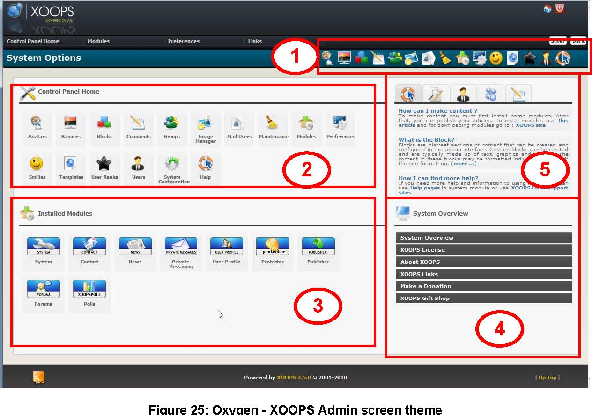
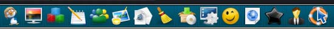
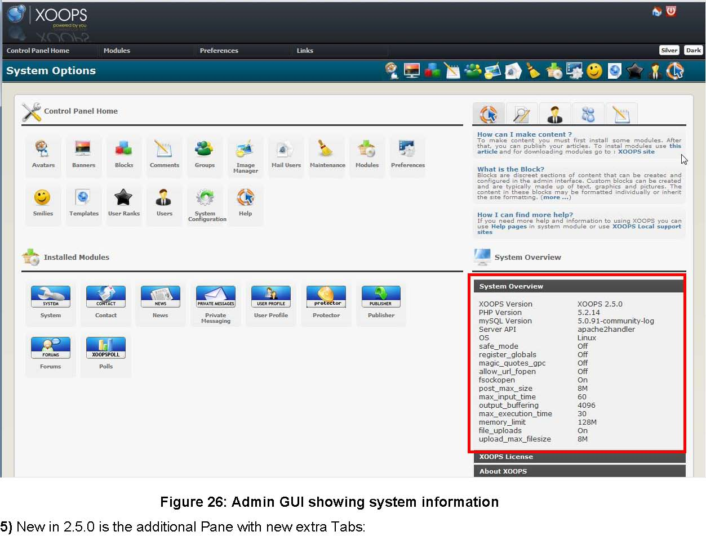
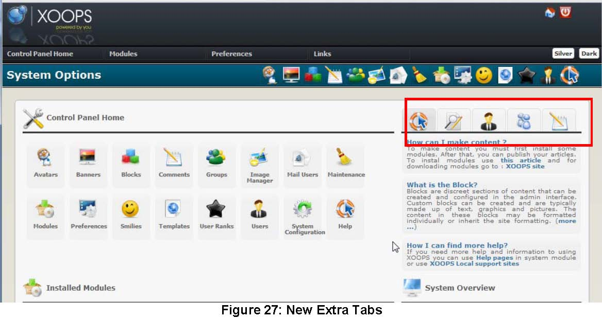
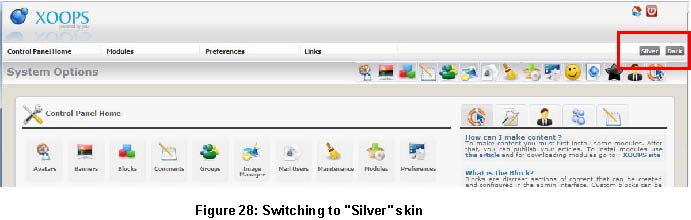
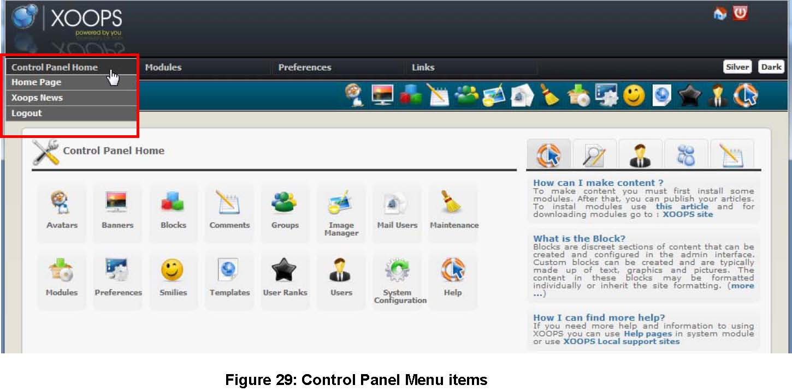
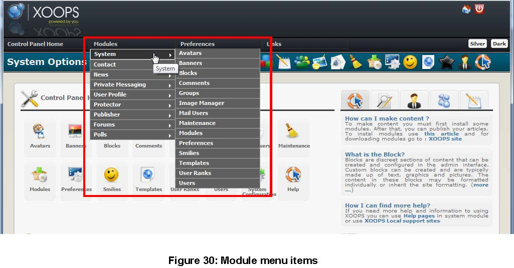
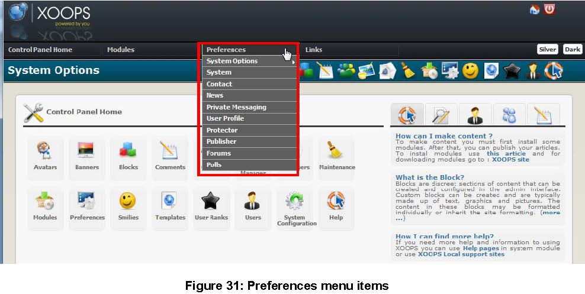
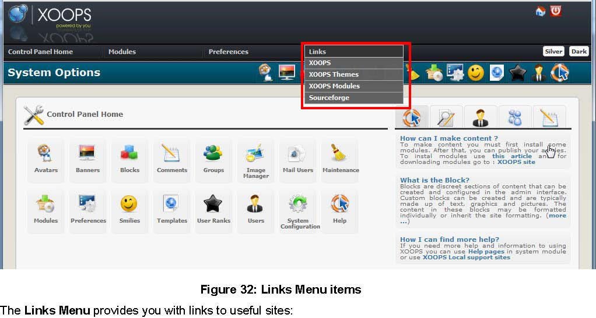

# Appendix 1: Working with the new Admin GUI \(our Dashboard\)

## Appendix 1: Working with the new Admin GUI \(our Dashboard\)

XOOPS 2.5 has as a default a new Admin GUI – the “Oxygen”, developed by Voltan \(Hossien Azizabadi\), and which is based on EXM created by Bit3CR0 \(Eduardo Cortés\).

Our new Dashboard is a major move forward toward improved ease of use for XOOPS users, with nice GUI and clear pull-down menus, as well with System Information and helpful Tabs.

1\) On the very top you see a Toolbar \(1\) with several buttons:

that provide a direct access to the System Options:

| Icon | Function |
| --- | --- |
|  | Avatars |
|  | Banners |
|  | Blocks |
|  | Comments |
|  | Groups |
|  | Image Manager |
|  | Mail Users |
|  | Maintenance |
|  | Modules |
|  | Preferences |
|  | Smilies |
|  | Templates |
|  | User Ranks |
|  | Users |
|  | Help |

2\) The System Options are also visible in the Pane \(2\)

3\) The “Installed Modules” Pane \(3\) shows images of the currently installed modules

4\) In the “System Overview” Pane \(4\), you can check your current System values \(like PHP and Apache versions, and most important configuration values, as well as more info about XOOPS, and links to our Gift shop, in case you would like to purchase a T-Shirt or coffee mug with XOOPS Logo.

The new Tabs provide extra information for the Administrator:

| Icon | Function |
| --- | --- |
|  | Help |
|  | Waiting Content |
|  | New Members |
|  | Top Posters |
|  | Recent Comments |

XOOPS 2.5.0 provides couple of “skins” that you can change for a different look of the default theme, with currently available: Dark and Silver:

Of course, you will be able to create your own skins, if desired.

In the **Control Panel Menu** you have following choices:

| Menu Item | Description |
| --- | --- |
| Home Page | It will get you to your Homepage |
| XOOPS News | It will pull latest XOOPS news from www.xoops.org |

Logout It will log you out from your website

The Modules Menu will show all installed modules, and in a submenu for each of them – their individual options.

The **Preferences Menu** shows preferences for XOOPS as well as individual modules that you have installed on your system.

* XOOPS Website
* XOOPS modules repository
* XOOPS Themes gallery
* XOOPS Project location on SourceForge

