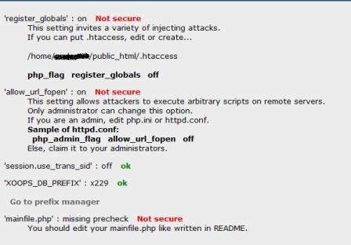
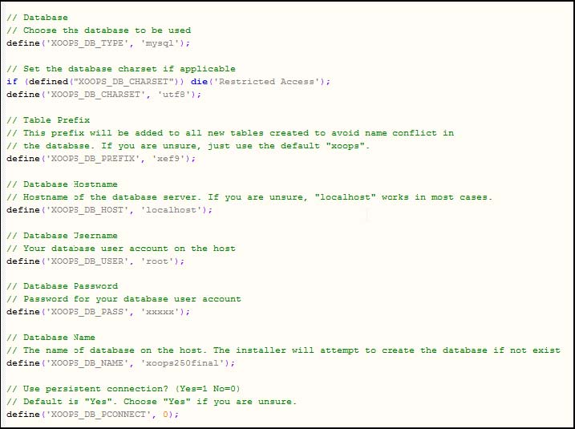
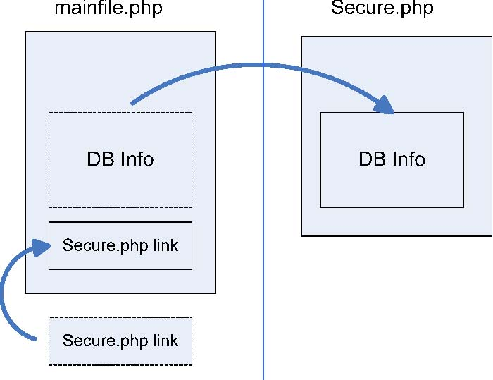
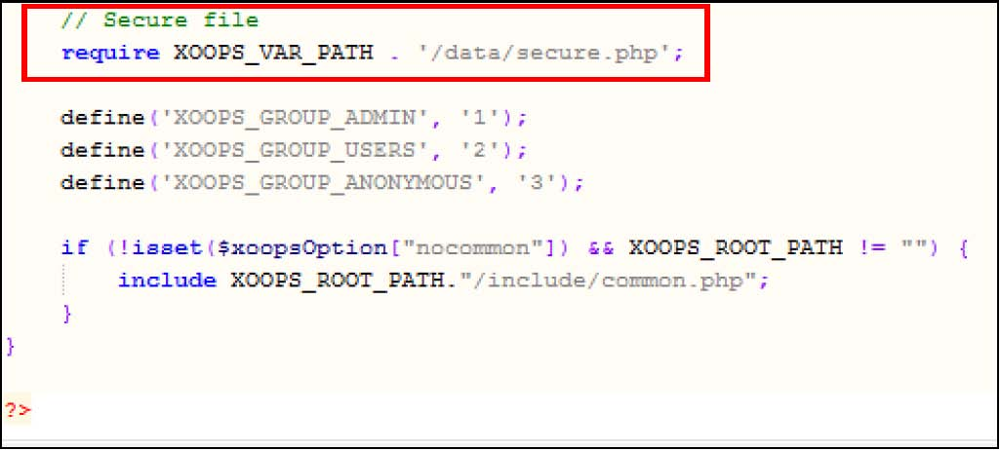

### Appendix 5: Increase security of your XOOPS installation

After you’ve installed XOOPS, you can increase its security by following few simple steps.

**1) First, go to the Protector. **

When there, you might see some warnings. 
'register_globals' and' allow_url_fopen 'you have already asked hostgator to change, so it will change when they have had hold of your ticket. 

 

 
**2) Changes in mainfile.php **

XOOPS 2.5.0 brings another security enhancement. 
The part of the mainfile that contains info related to database, its user name and password:

 
 has been moved to /xoops_data/data/secure.php  file, which when placed outside of the Document Root, makes it harder to hackers to access it - see the figure below:
 

However, when you update to XOOPS 2.5.0 from an older XOOPS installation, the DB information will stay in the mainfile. 
But you can do it also manually, i.e. move the DB Info part to the secure.php, but make sure that you also add in the mainfile.php the link to the /xoops_data/data/secure.php file like this:

 

Once you save and close both files, remember to change the rights of both of them to 404. 

Remember also to delete the folder "install" from your XOOPS Installation.

