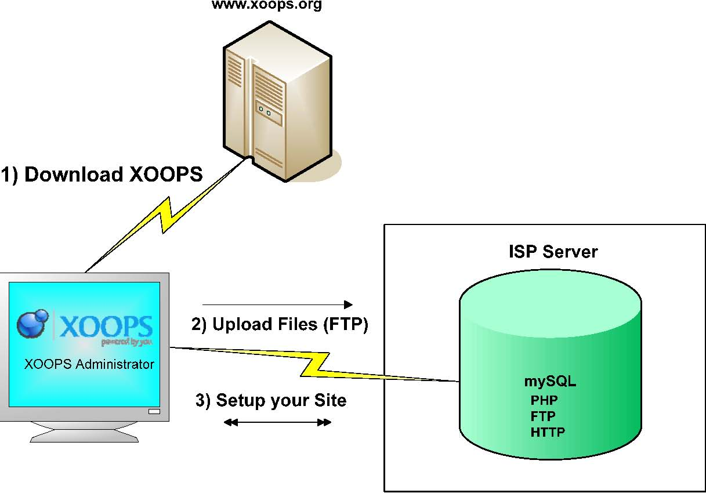

## Chapter 1: Preamble 

Welcome to XOOPS Installation Guide. 

Currently, this guide assists with the installation of a new XOOPS site provided the hosting environment is established. 

The XOOPS Documentation Team is working to build new and update existing basic documents for all users to have a useful repository. We have little time to cover a lot of ground, so please be patient. 

We welcome your comments, reviews, opinions and in general whatever feedback you can provide us to make this guide a better tool for other XOOPS users 

***The XOOPS Documentation Team***

 
 

Figure 1: Installation Process

