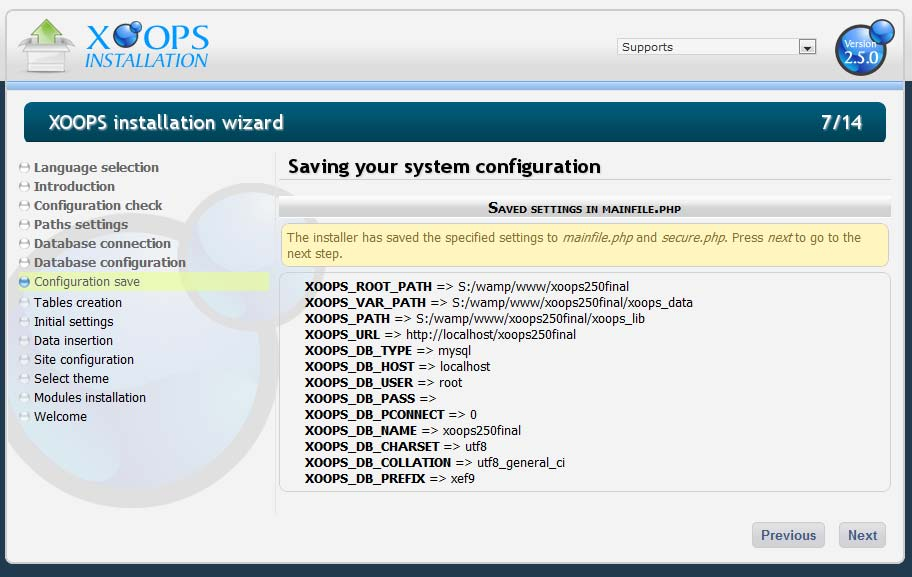

### Chapter 5: Database Connections 

The next step is to start configuring the soon-to-exist XOOPS site. 
With the paths and folder permissions correct, it's time to give the wizard information about the database that we’ll be using. Screen 5/14 should look like Figure 8: 

 
   
Figure 8: Database connection details

The first selector is for the moment a reminder that XOOPS looks into the future.  Currently, only MySQL databases can be used. No choice is required. 
If the mysql option is not visible, an error has occurred and the installation process should be started from the beginning. 
The next field is the Server host name, the host of the MySQL database server. The default entry is localhost.  It does not likely need to be changed. 
The database username and password are entered next. For a local installation, the username “root” will likely work with the appropriate password.  
For an installation in a remote environment, the database username and password should have been set up in advance.  If they are not available, pause the installation and set up the username and password on the remote server.  The installation cannot continue without this information.
Next comes a Yes/No question about using persistent connections in the MySQL database. The default option is No, and it should be left as such except by advanced users.  For more information on this subject, refer to: "MySQL Newsletter Using persistent connections with MySQL". 

 

Figure 9: Error displayed if a connection to the MySQL server is not made  
If there are problems with connection to the database, XOOPS will return the error in Figure 9 – make sure the settings are correct. 

 

Figure 10: Database Configuration
In step 6/14, the connection has been established and the XOOPS database is configured. Using a name that has relevance to the site is suggested, particularly if there are several databases in use. XOOPS will prefix each name with the string contained in the next field, "Table Prefix" so a short prefix is suggested. This prefix can be changed later. The recommended option is to leave it as it is. Although the field in Figure 10 says “xef9”, the prefix added to every table is xef9_, with an underscore at the end.   The Database character set and Database collation do not need to be changed.
 
