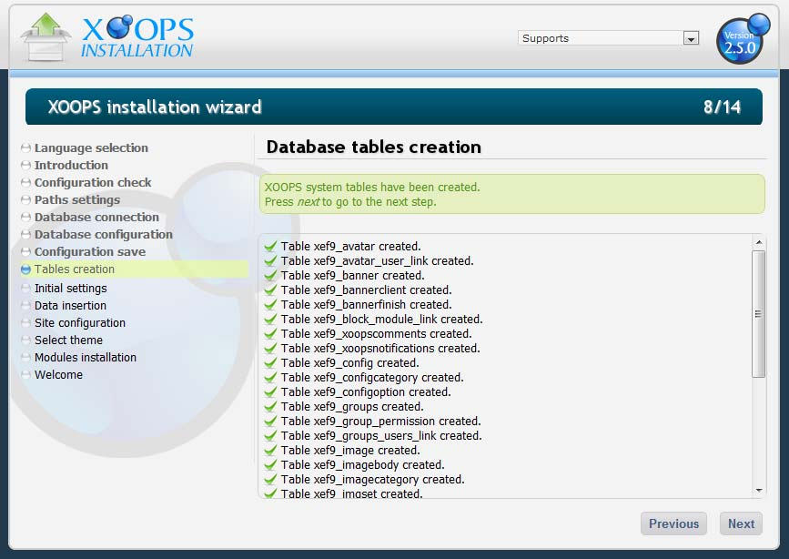

### Chapter 6: Final System Configuration 

With all of the information added, the Installation Wizard is ready to write all the information to the mainfile.php and the secure.php file. If the information provided about the database was correct, the result should be similar to Figure 11.
 
  

Figure 11: You have another chance to take a look at what you entered
If all data is correct, push the [Next] button and the Installation Wizard will attempt to connect to the database server to confirm the MySQL database is active and running and then will try to connect to the database specified. 

If the MySQL server is setup correctly, the Installation Wizard will try to access the database, in this case the one called “xoops250final”.  If it accessed the database successfully, the required tables for XOOPS.

 
 

Figure 12: Database table creation list

Screen 8/14 (Figure 12) presents all of the database tables that support the System Module of a new XOOPS site. 

A new XOOPS site creates 32 tables. Following is a list of the tables and a brief description of their function: 

|Table|Description|
|---|---|
|xef9_avatar| Holds the identity, path and name of user avatars. |
|xef9_avatar_user_link| Ties an avatar's id with a user's id, so each user “knows” its avatar.|
|xef9_banner |Holds all the information about a specific banner.|
|xef9_bannerclient | Holds all the information about a banner customer.| 
|xef9_bannerfinish | Holds all the information about expired banners, with their click count.|
|xef9_block_module_link link |Ties a block's id with a module's id, so each block “knows” the module to which it belongs.|
|xef9_cache_model | holds value for cache model.|
|xef9_config | Holds XOOPS general configuration variables.|
|xef9_configcategory | Holds the configuration categories.|
|xef9_configoption | Holds configuration options.|
|xef9_group_permission | Holds the details of permissions granted to each group of users.|
|xef9_groups | Holds the identity of users' groups.|
|xef9_groups_users_link| -Ties a user's id with a group's id, so each group "knows" its users, or each user "knows" to which group it belongs.
|xef9_image | Holds all the information about an image stored in the system.|
|xef9_imagebody |Holds an image, in case you decide to write images in the database.|
|xef9_imagecategory | Holds the image categories you define in the Image Manager.
|xef9_imgset  |Holds the identity of an image set.
|xef9_imgset_tplset_link |Ties an image set's it with a template set's id, so a template set "knows" what images belong to it.
|xef9_imgsetimg | not used.
|xef9_modules | Holds all the information about a module.
|xef9_newblocks | Holds all the defining attributes of a block.
|xef9_online | Holds the information about users online.
|xef9_priv_msgs  |Holds all the information about a private message.
|xef9_ranks | Holds the users ranks defined in the admin area, to qualify user's participation in the site.
|xef9_session | Holds the information about a session.
|xef9_smiles|  Holds the information about the codes used to display smilies.
|xef9_tplfile | Holds the metadata of a file that's part of a template set.
|xef9_tplset|  Holds the information about a template set.
|xef9_tplsource | Holds the data (the source code) of a file that's part of a template set.
|xef9_users | Holds all the information about a user.
|xef9_xoopscomments | Holds all the information about a comment.
|xef9_xoopsnotifications | Holds all the information about notifications.|

All tables are created blank, ready to be populated. 

The list of tables will grow with each module that is added to the site.   As noted earlier, the tables listed above are for the System Module only.

