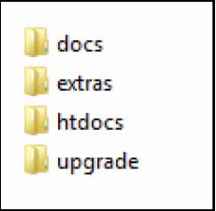
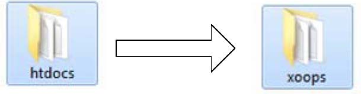
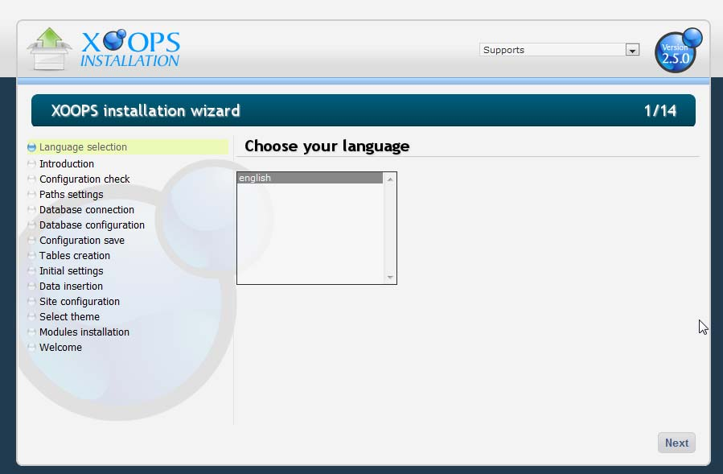

# Chapter 2: Introduction

The XOOPS Installation Guide provides an overview of how install XOOPS on your Web server. it is assumed users already have a working environment that is either **LAMP** or **WAMP**.

Efforts have been made to ensure this is not merely a sequential installation document. Useful tips and pointers about XOOPS are provided as the user is guided successfully through the installation process.

If you require an installation in a language other than English, please skip now to step 6 and review the translation information and instructions to ensure you have what you need before starting the installation.

To proceed successfully, the following is required on either a local machine or hosted server:

1. a place to run that includes:  

   a. the Apache web server;   
    b. the database manager MySQL;  
    c. scripting language PHP, either on a Linux or a Windows platform; and  

2. a downloaded copy of the latest XOOPS version \(currently 2.5.0\).

With the hosting environment available, the following steps are recommended to prepare for the installation:

1\) Download either the TAR file or ZIP file to a local machine and uncompress the archive \(using, for example, 7Zip program – see “Useful Tools” Appendix\)

The resulting new directory has four subdirectories: docs, extras, htdocs, and upgrade.

* The docs subdirectory includes the change log, GNU/GPL license, a credits file. 
* The upgrade subdirectory includes files needed for upgrade older versions of XOOPS.
* The extras subdirectory includes optional files to be used for specific configurations \(read the \*.txt files for explanations\)
* The htdocs subdirectory, contains all the code of your XOOPS site.  

2\) Copy the htdocs subdirectory to the root directory of your local or remote environment. If the installation is on a local machine, this means copying the directory to a directory where the web server will look for files. For example if using WAMP \(www.wampserver.com\), the web root directory is called www. This will give you a file path of www/htdocs/

3\) Once copied, rename the htdocs directory on the server to xoops. This means that the local site is accessed by typing “[http://localhost/xoops](http://localhost/xoops)" in a browser.

When installing on a hosted, remote server, the htdocs directory must be uploaded to an accessible directory. Most remote servers have a public\_html or htdocs folder. That is the location where the contents of the XOOPS’ htdocs folder on the local computer must be uploaded. A FTP client software \(see Appendix “Useful Tools”\) is used for uploading files to you host. Once all of the files are uploaded to the root directory, you can access them via [http://www.yoursite.com](http://www.yoursite.com).

> **Caution:**
>
> At this point it is important to note that only the content of the htdocs folder is uploaded to the root folder. Otherwise, the installation will be located in [http://www.yoursite.com/htdocs](http://www.yoursite.com/htdocs)..

4\) For local server: ensure that the server is running once a local installation has been completed. This means to start the server application via the applicable control panel. This is not a requirement for an installation on a remote server.

5\) The downloaded package includes two files that are used to verify the contents of uploaded files. They are checksum.mdi and checksum.php. These files assist in verifying that the contents of the root folder are correct. To use the checksum files:

* copy checksum.php and checksum.mdi into the root folder of the site;
* access the checksum.php file via [http://www.yoursite.com/checksum.php](http://www.yoursite.com/checksum.php) and review the page;
* re-upload any that are shown to be missing or invalid; and
* delete checksum.php and checksum.mdi once the folder contents are confirmed.

6\) Enter the applicable address into a browser to access the directory holding the contents of the htdocs folder. On a local machine, it should be [http://localhost/xoops](http://localhost/xoops). On a remote server the address will be [http://www.yoursite.com](http://www.yoursite.com). If everything was uploaded properly, accessing the site will launch the XOOPS Installation Wizard.

> **Note:**
>
> How can I have several Xoops websites on the same web server ? If you want to install several website on the same server, copy XOOPS files into different subfolders, e.g.:  
> • www/01\_xoops/  
> • www/02\_xoops/  
> • www/03\_xoops/  
>   
> The wizard is able to distinguish between :  
> - Webserver root folder \(/www\),  
> - and the root folder of each XOOPS

  
The wizard opens a page in the browser with the following content:

  
Figure 2: Language selection page of the XOOPS installation wizard  

> **Resources** 
>
> If you would like to have a XOOPS installation in other language than English, please visit a local support site for a local version, or visit XOOPS on SourceForge.

  
If an installation in a different language is required but not available, you’ll need to do the translation yourself. Within the install folder there is another folder called language. Inside the language folder there is another folder called /english. Make a copy the folder and rename the new folder to your local language, e.g. /spanish. Then translate the English text into your language. This will facilitate the installation in the language of your choice.

> **Note**
>
> For more info on how to translate the files, see Appendix 3.

New translations are always welcomed by the XOOPS community. Submitting translations can save time for other users and make XOOPS better for everyone.

All this needs to be done before the installation, so when the wizard reads the files, the desired languages are available.

7\) Click \[Next\] to open the next screen \(Figure 3\) with introductory content. It includes a description of XOOPS, the license terms, environment requirements and requirements for the installation.

  
Figure 3: XOOPS Installation Assistant

The XOOPS Installation Assistant outlines key elements of the environment required for successful installation. More detailed explanations of the eight points are: 1. “Setup WWW server, PHP and database server properly.” This means the Web server is active, can process PHP files and a MySQL server is running. A username and password for the database are required. 2. “Prepare a database for your XOOPS site.” If the installation is on a remote server, the database must be set up in advance of the installation. Refer to the host’s documentation for details of creating databases on the server. For a local installation, the Installation Wizard is able to create the database itself.  
3. “Prepare user account and grant the user the access to the database.” The database will require a user account and password to access the database. This may be the same as the username and password used to create the database or it can be different. 4. “Make the directories and the files writable” This important step is often overlooked. The two noted directories and the file mainfile.php must be editable. This means in a Unix/Linux environment that the permission should be set to 777 for the installation procedure, to proceed correctly. 5. “For security considerations, you are strongly recommended to move the two directories below out of the document root and change the folder names” The directories of xoops\_lib and xoops\_data can present a security vulnerability if left with the original names. The ideal solution is to move them to directories at the same level or above the root folder. If that is not possible, they should be re-named using names that are obscure  
  
To make sure that the installation works, we recommend that you keep the xoops\_lib and xoops\_data as they are, if you’re a beginning XOOPS and Linux user. We’ll change them once XOOPS is installed and working.  
  
 6. “Create \(if not already present\) and make the directories writable” The directories listed should be present if the file upload was successful. It is a good step to confirm that they are all there and writable by setting them to 777 in Linux \(CHMOD 777\) 7. “Turn cookie and Javascript of your browser on.” Many of XOOPS options require the use of cookies. Without the use of cookies, the XOOPS site will not function properly. The same is true about Javascript; it is required to run many XOOPS core functions.

Confirm that the seven \(7\) requirements are met and click \[Next\].

