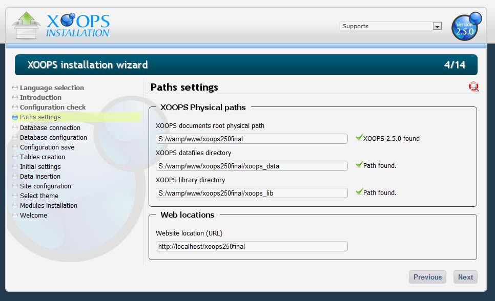
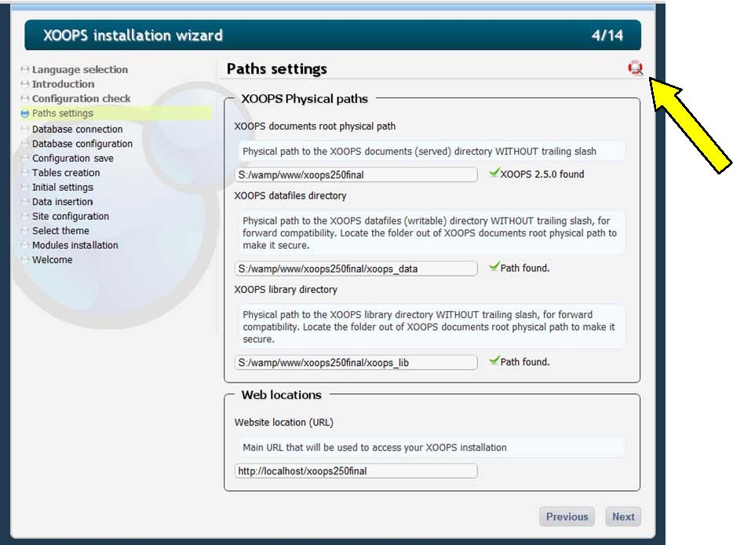
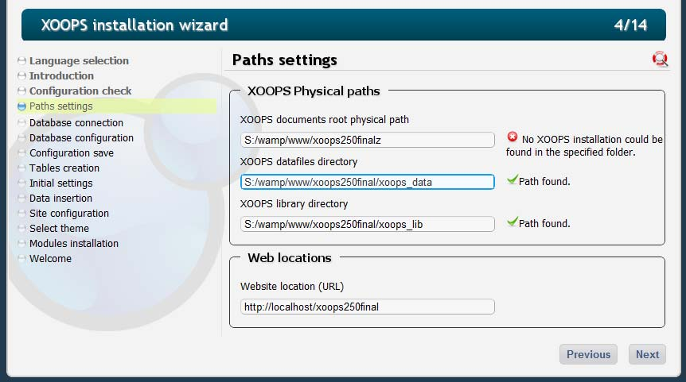
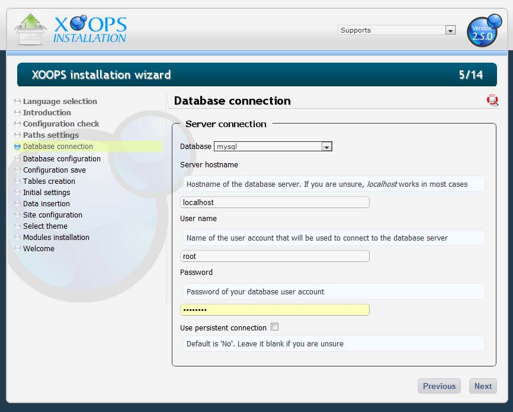
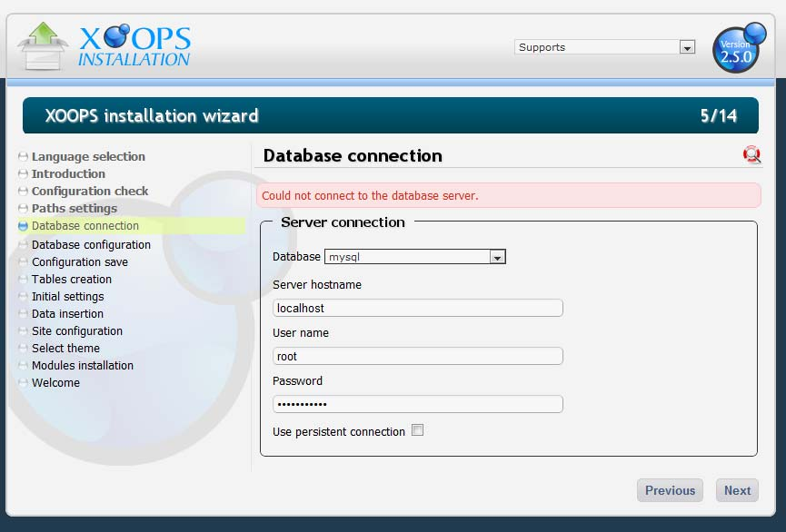
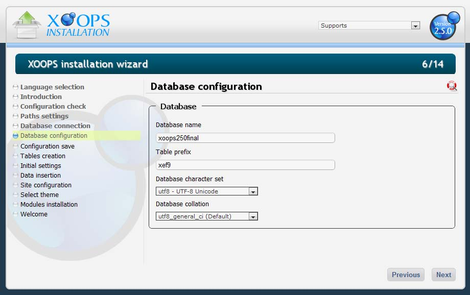

# Chapter 4: Take the Right Path!

This part of the installation should be quite easy, as you don't have to do anything. . If you did things right until now, Figure 5 is the next screen. The green checkmarks indicate the physical path and the virtual path were written correctly, enabling the Installation Wizard to create the additional paths.

  
Figure 4: Server configuration check.

  
Figure 5: The screen with all paths correctly written

If are not sure about any fields during the installation, you can click on the Help button \(see yellow arrow above\), and XOOPS will provide with some additional instructions \(see below\)

For the time being, please accept the paths for Datafiles and Library directories. We will change them later.

  
Figure 4: Server configuration check.

  
Figure 6: By clicking on the Help icon, you will get detailed explanations If you make an error in the physical path, the Installation Wizard will display an error:

  
Figure 4: Server configuration check.

  
Figure 7: The screen with an invalid URL in the physical path field. Once all paths are correct, click \[Next\].

