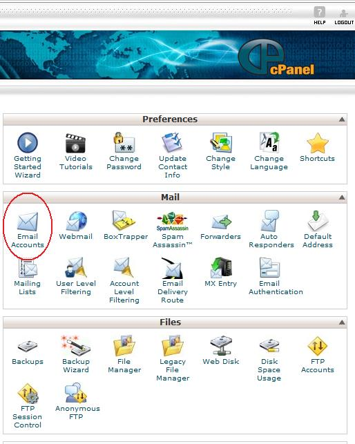
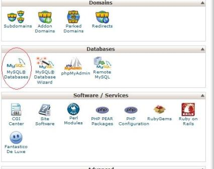
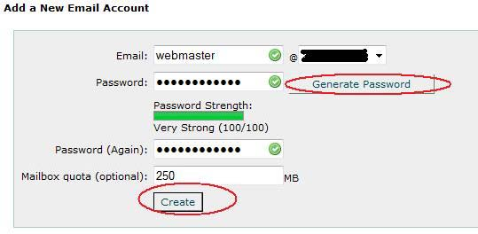
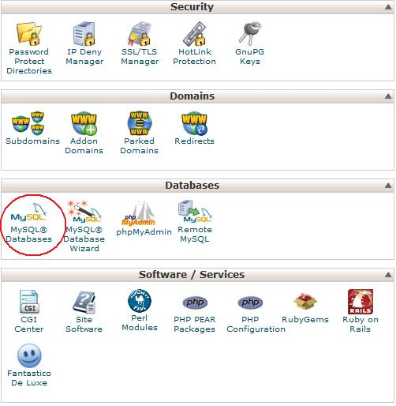
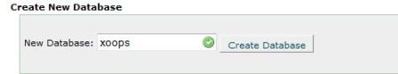
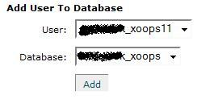
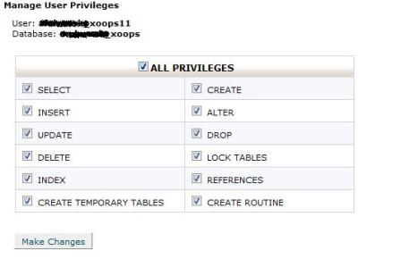
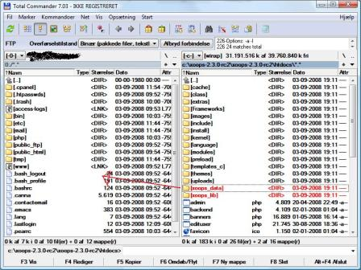
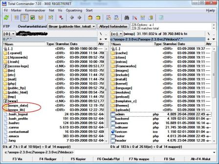
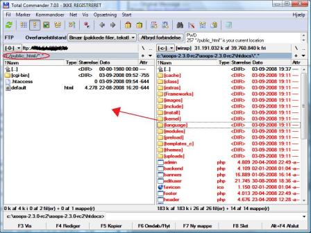

### Appendix 2:  Uploading XOOPS via FTP

This tutorial will show how to set up XOOPS for an installation on a Website hosted by Hostgator. 

**Prepare your host **

The first thing you must do is to create a case (ticket) in hostgator. 

The changes you must have done now is just one of the things other hosts do not do - so it is a little expensive. 

Type the following: 

Quote:
>Username: **your username ** 
>Domainname: **your domain name**  
>Please create a custom .htaccess and PHP.ini file for my web, and turn the 'register_globals' and' allow_url_fopen 'off. 

It tends to be no problem. 

Now you can then log into your Cpanel, which the administration since the states. 

The first time you log in, you see the following picture. 
You can always return to this by clicking on "Home" in the upper left corner. 

 

We start with creating a mail to the Webmaster. 
Click on the icon "email accounts" 
 

Write email and enter a password. 
If you are not required to use the phone, then let the system generates a password for you. So you get a strong password! 

Exit to click on "Create" 

Scroll down to the administration page and select "MySQL databases" 

  

Create a user with an optional name and let the system generates a password for you. 
You must virtually never use this password, so why use one that is easy to crack?

 
 
 

Scroll down and select "New Database" 

Enter a name and choose 

  

Now you must give the user access to the database. 

Find the box "Add User to database" and select a user and database. 
Click 

  

Put notch in the All Privileges and click 

  
 

**Upload **

So we need to have uploaded Xoops. 
We start with upload folders xoops_data and xoops_lib. 
These two folders uploaded next to the folder public_html 

  

When they are uploaded would like to look like this 

 

 

Then upload the remaining folders and files to the folder public_html 

  

Now you are ready to install XOOPS and proceed with the XOOPS Installation Wizard.

 
