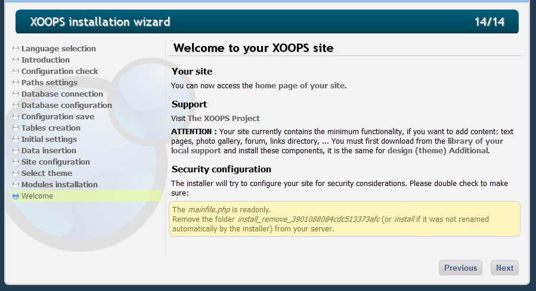
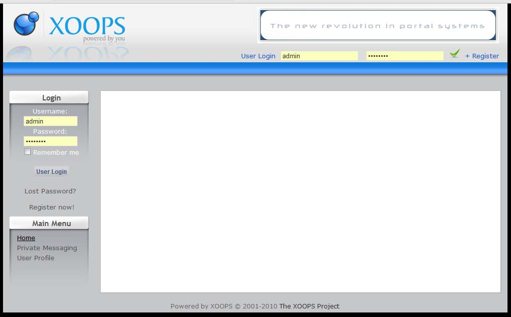
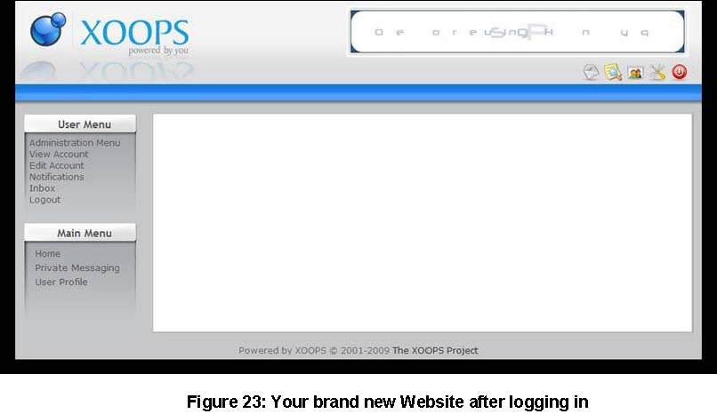
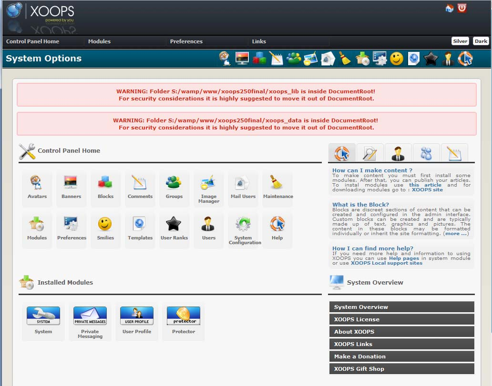
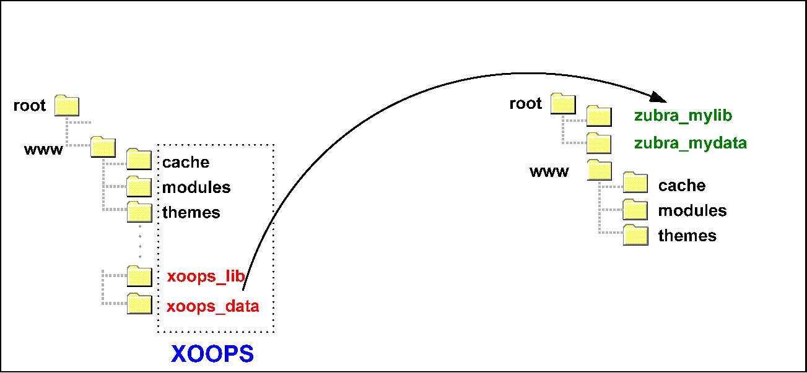
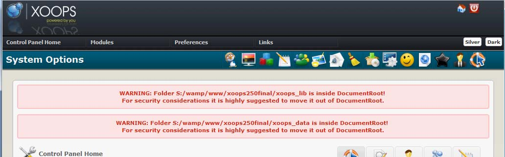
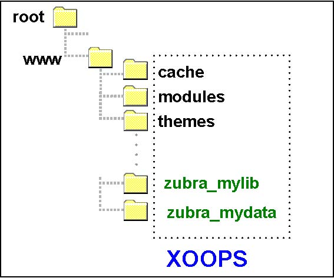

### Chapter 8: Ready to go! 

If everything has gone as planned, screen 14/14 will look like Figure 21.  
 
 

Figure 21: Final Installation screen

The installation is complete.  For security purposes XOOPS set the “mainfile.php” and the “secure.php” files as ReadOnly, and renamed the “Install” folder to a unique name. You should delete that folder. The [Next] button will close the Installation Wizard and open the homepage of the new site (Figure 22).
 
 

Figure 22: XOOPS First Page

Now you can login using the User Name and Password created during step 9/14 of the installation. If the password is accepted, this Welcome message will be displayed with whatever username was selected replacing “admin”
In few seconds the website member area home page will be displayed as in Figure 23.
 
 

Figure 23: Your brand new Website after logging in

Note that the User Menu has appeared.  To manage the Website, you will use the Administration area, that you can access via the Administration Menu link.

 

Figure 24:  Control Panel Home

When the Administration area is accessed for the first time, tow or three warnings will be present.  On a local installation, these warnings are not of concern as they are only for security purposes on servers.

1.	The file mainfile.php located in the site’s root folder should be changed to “read-only”. On Linux set the property to 444. The same is for secure.php file located in /xoops_data/data
2.	The other two relate to moving two directories: xoops_lib and xoops_data out of the Document Root.

> **Warning **

> "xoops_lib" and "xoops_data" are directories, which are locations for "XOOPS_PATH" and "XOOPS_VAR_PATH" respectively, and they should be located outside of the "Document Root"

The Document Root is a directory on you host's servers, below the “Server Root”, and which is designated for holding web pages. That’s where XOOPS should be in.
However, every host is different and they might use different name for the Document Root. Some of the most common names are:

    * htdocs
    * httpdocs
    * html
    * public_html
    * web
    * empty — no value (such as GoDaddy-hosted sites)

In our tutorial, let’s assume that the name of Document Root is “**www**”. 
Access the root folder of the site with your FTP software and find the directories xoops_data and xoops_lib.  If possible, move these two directories up one level to the same level as the root folder and re-name them to obscure names.  If re-locating the folders is not possible due to restrictions by the host, re-name both folders and note the new names.  This change is for site security (see **Appendix 4**).
The re-location and re-naming of the xoops_lib and xoops_data will ideally result in a structure like:

 

 
> **Caution **
In some cases, your Host doesn’t allow to move any directories outside the Document Root. In such a case, we recommend change the Host. If this is not possible, you still should rename the the xoops_lib and xoops_data to a different name (see below).

  

> **Info **  

> If you would like to hide the above warnings, you can do it by going to /xoops_data/configs/xoopsconfig.php and setting the value to “0” in:
"admin_warnings_enable" => 0, 

 
If access at the same level as public_html is not possible, the structure will be similar to:
			
  
 
Once done, you have to update the secure.php located in /xoops_data/data/ to point to the correct physical paths for the directories:

> **Code**
>
// Physical path to the XOOPS documents (served) directory WITHOUT trailing slash
define( 'XOOPS_ROOT_PATH', '/root/www' );
>
// Physical path to the XOOPS library directory WITHOUT trailing slash
define( 'XOOPS_PATH', '/root/www /zubra_mylib' );
>
// Physical path to the XOOPS datafiles (writable) directory WITHOUT trailing slash
define( 'XOOPS_VAR_PATH', '/root/www /zubra_mydata' );
>
// Alias of XOOPS_PATH, for compatibility, temporary solution
define("XOOPS_TRUST_PATH", XOOPS_PATH);

This concludes the Installation Guide. Did everything go well? Did you learn also some things additional about XOOPS? Have you any comments you wish to share with us? Please let us know your comments about this guide, about what we can do to improve it, about what we need to add to make it more useful and complete, and whatever you want to tell us (unless you're too fond of swearing: there are kids around here). 

Please address all comments to <documentation@xoops.org>. They will be well received. Honestly. 

 
