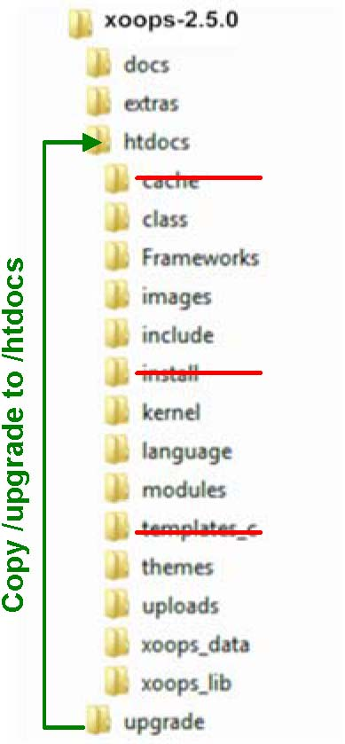

### Chapter 9: Upgrade Existing XOOPS Installation

>	**Warning **

>If you use custom templates, you should convert them into files inside your theme folder before upgrading. 

Assuming that you have a structure in your existing XOOPS Installation as discussed above, and would like to upgrade it to XOOPS 2.5.2, i.e. you have renamed and moved your xoops_lib and xoops_data directories outside of Document Root, these are the steps to upgrade your XOOPS Installation:

1)	Backup all XOOPS files & your XOOPS database!!! 
2)	Pre-Upgrade Instructions: 
 a.	Unzip the downloaded “XOOPS Release” into a temporary folder 
 b.	Delete unneeded Files/Folders from /htdocs 
 i.	Delete cache, install, and templates_c folders 
 ii.	Delete mainfile.php, favicon.ico (typically, but leave if you didn’t modify it)

 c.	Copy upgrade folder into /htdocs 
 d.	If you have installed AltSys Module: 
 i.	Copy altsys folder in current XOOPS_TRUST folder to xoops_lib/modules folder 
 ii.	In xoops_lib folder, make symlink of libs -> modules (for altsys compatibility) 
  3)	Merge Core/Module Modifications (if in core release) 
 a.	Merge any core files modified for your installations 
 i.	robots.txt (only if changed)
 b.	Merge Frameworks 
 i.	Essentially, start with the latest Frameworks 1.22 (and/or merged with 1.35      if used), then add/overwrite files with Frameworks for XOOPS 2.5.0, then      add/overwrite files with the XOOPS 2.5.x core files. 
 c.	Merge images, languages, uploads folders 
 d.	Merge WYSIWYG editor changes 
 4)	Delete /modules/system from existing site
 5) Copy/Move Files (over existing site)  
	

6)	Perform Upgrade
 a.	Remove files from cache and templates_c folders (keep the index.html files) 
 b.	Make mainfile.php writeable
 c.	Run upgrade script (http://yoursite.com/upgrade) 
 i.	Point to xoops_data and xoops_lib directories 
 d.	Update system, protector, and other core modules if installed 
 e.	Delete upgrade folder 
 f.	Update non-core modules individually (make sure using the latest versions) 
 7)	Post-Upgrade File Restructuring 
 a.	Move new xoops_lib and xoops_data folders into XOOPS_TRUST directory; remove    the old, unneeded files and folders 
 b.	Delete and redirect cache and templates_c folders via symbolic link 
 c.	Update mainfile.php to reflect the above changes 
 d.	Make mainfile.php unwriteable (chmod 444)
 e.	Make Module Specific Changes 
 f.	Remove old, unneeded files 
 g.	Update FCKeditor module-specific configurations in all modules (if any) 
 8)	Test - Perform integration/regression testing on all modules 
 a.	Review templates changes/updates for all modules and incorporate as appropriate

> **Warning** 

> If you use any modules that utilize the “XOOPS_TRUST_PATH” and you have them installed on your Website, make sure that the content of it is being moved to your “xoops_lib” directory, and the current “XOOPS_TRUST_PATH”” is deleted, and if needed, the mainfile.php is modified accordingly. 

XOOPS can post only to one “XOOPS_TRUST_PATH”” directory, which in XOOPS 2.5.x is the xoops_lib directory 

-----------------------------------
